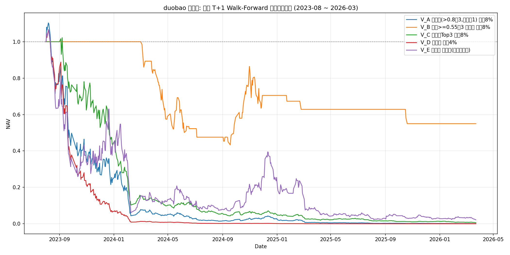

# duobao 修复版 —— 严格 T+1 Walk-Forward 回测结果

> 时间线: T日收盘特征 + T+1盘前新闻 → T+1开盘买入 → T+2止盈/收盘卖出

> 成本: 0.31%双边 | 股票池: 非688/689, 市值<=100亿, 成交额>=5000万 | 月度WFO重训(7天embargo)

## 回测区间

- 20230801 ~ 20260324, 初始资金 ¥100,000
- 样本数 1420971, 标签正样本率 15.43%

## 变体对比

| 变体 | 总收益 | 年化 | 夏普 | 最大回撤 | 交易数 | 胜率 | 平均盈 | 平均亏 |
|---|---|---|---|---|---|---|---|---|
| V_A 原规则(>0.8取3,否则取1) 止盈8% | 总收益 -99.91% | 年化 -93.86% | 夏普 -0.81 | 最大回撤 -99.92% | 交易 607 | 胜率 47.45% | 平均盈 +5.18% | 亏 -6.19% |
| V_B 概率>=0.55取3 可空仓 止盈8% | 总收益 -45.01% | 年化 -21.07% | 夏普 -0.66 | 最大回撤 -56.69% | 交易 237 | 胜率 48.52% | 平均盈 +4.80% | 亏 -5.23% |
| V_C 固定取Top3 止盈8% | 总收益 -99.40% | 年化 -86.80% | 夏普 -1.17 | 最大回撤 -99.41% | 交易 1728 | 胜率 48.50% | 平均盈 +5.27% | 亏 -6.35% |
| V_D 原规则 止盈4% | 总收益 -100.00% | 年化 -98.78% | 夏普 -0.96 | 最大回撤 -100.00% | 交易 607 | 胜率 50.74% | 平均盈 +3.26% | 亏 -6.41% |
| V_E 原规则 无止盈(纯收盘卖出) | 总收益 -97.84% | 年化 -78.06% | 夏普 -0.54 | 最大回撤 -97.97% | 交易 607 | 胜率 45.14% | 平均盈 +7.21% | 亏 -6.10% |

## 净值曲线

